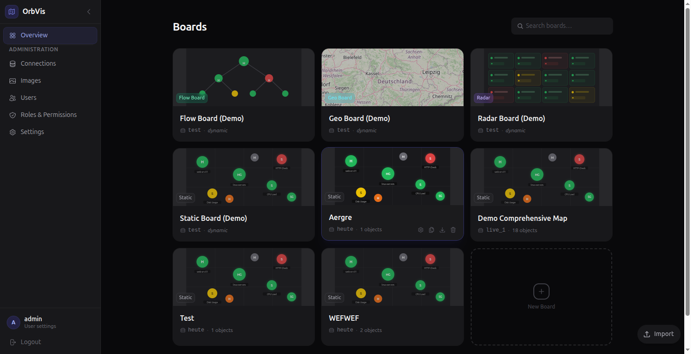
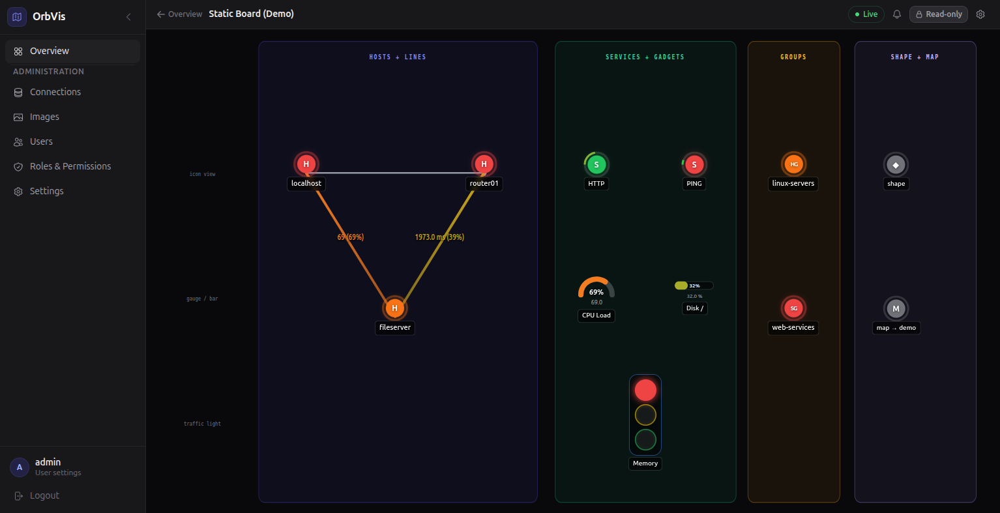
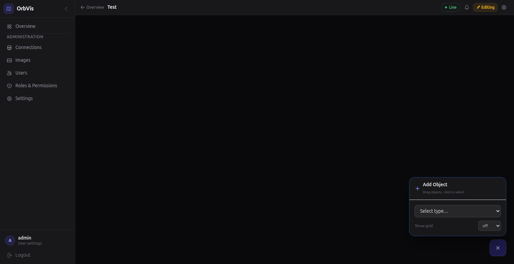
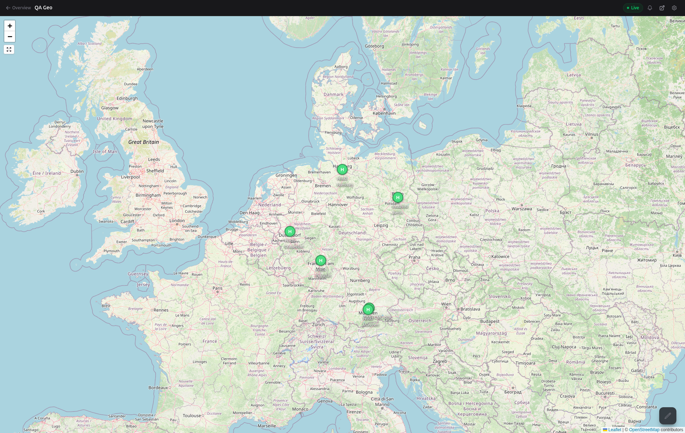
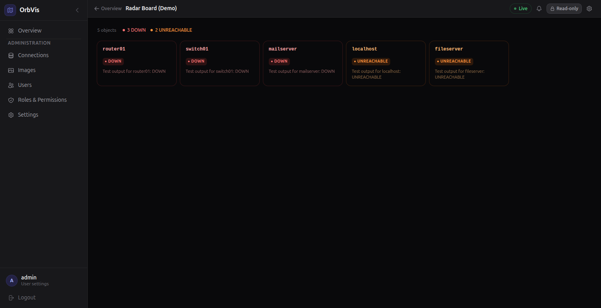
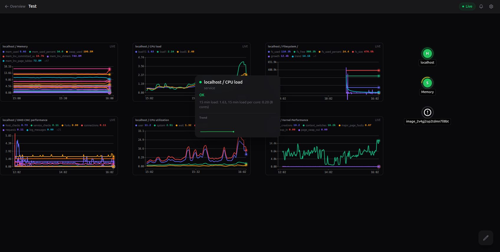
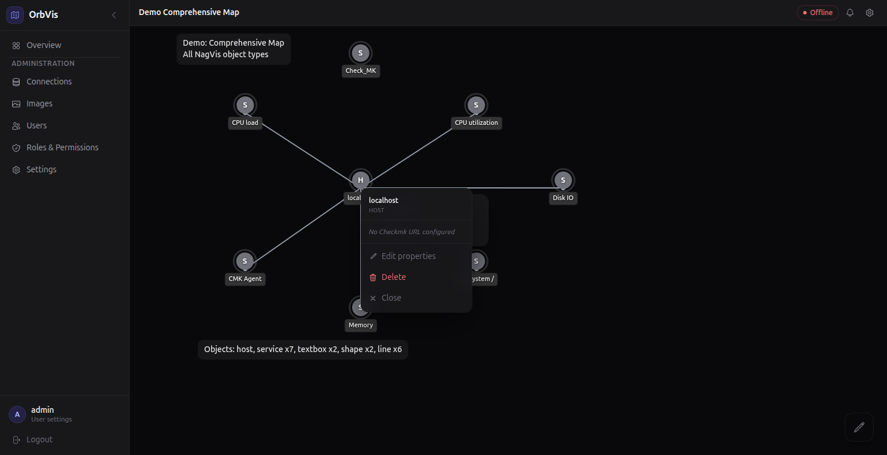

# OrbVis

A modern monitoring-visualisation platform — a community successor to
NagVis. Real-time WebSocket updates, native Checkmk integration,
force-directed topology and geo boards. Built with **FastAPI** ·
**SQLAlchemy 2.0** · **Vue 3** · **TypeScript** · **Vite** · **Pinia** ·
**Tailwind CSS** · **D3.js**.

> OrbVis is in **public beta**. The codebase has been used internally
> for several months and is stable enough for daily use, but expect
> rough edges and please report issues. License: GPL-2.0-only.

|  |  |
|---|---|
|  |  |
|  |  |
|  |  |

## Documentation

- [Install guide](docs/install.md) — MKP, standalone, Docker, production hardening
- [Migration from NagVis](docs/migration-from-nagvis.md) — `cfg_importer.py` walkthrough
- [Architecture](docs/architecture.md) — backend, frontend, state pipeline
- [Troubleshooting](docs/troubleshooting.md)
- [OrbVis vs. NagVis](docs/comparison.md) — feature-parity matrix
- [Roadmap](ROADMAP.md)
- [Contributing](CONTRIBUTING.md) · [Code of Conduct](CODE_OF_CONDUCT.md) · [Security policy](SECURITY.md)

## Migrating from NagVis

OrbVis ships `tools/cfg_importer.py`, which converts legacy NagVis
`.cfg` map files to OrbVis JSON boards:

```bash
# Single file
python tools/cfg_importer.py /opt/omd/sites/<site>/etc/nagvis/maps/datacenter.cfg ./out/

# Whole directory
python tools/cfg_importer.py --batch /opt/omd/sites/<site>/etc/nagvis/maps/ ./out/
```

See [docs/migration-from-nagvis.md](docs/migration-from-nagvis.md) for
what carries over (and what doesn't), step-by-step migration order, and
how to copy backgrounds.

## Installation

### From package (recommended)

Download the latest `.deb` or `.rpm` from the [Releases](../../releases) page and install it:

```bash
# Debian / Ubuntu
sudo dpkg -i orbvis_X.Y.Z_amd64.deb

# RHEL / Rocky / AlmaLinux / SUSE
sudo rpm -i orbvis-X.Y.Z.x86_64.rpm
```

No Node.js or npm required — the package includes a pre-built frontend.

**With Checkmk / OMD via MKP** (Checkmk Exchange):

```bash
omd su <site>
mkp add ~/orbvis-X.Y.Z-cmk2.3.mkp     # for CMK 2.3 / 2.4
# or:  orbvis-X.Y.Z-cmk2.5.mkp        # for CMK 2.5+
mkp enable orbvis
orbvis-setup
```

OrbVis is then reachable at `https://<host>/<site>/orbvis/`. See
[docs/install.md](docs/install.md) for upgrade and uninstall.

**With Checkmk via .deb / .rpm** (alternative path):

```bash
sudo orbvis-setup <site-name>
```

**Standalone** — set up a systemd service with nginx or Apache:

```bash
sudo orbvis-install
```

### From source

Requirements: Python 3.12+, Node.js 18+, systemd (standalone only).

**Standalone:**

```bash
./install.sh
```

Installs to `/opt/orbvis`, creates a system user, builds the frontend, and configures a
systemd service. nginx or Apache is configured automatically if present.

The default admin password is printed once on first start:

```bash
sudo journalctl -u orbvis --no-pager | grep 'Default admin'
```

To uninstall (user data is kept):

```bash
./install.sh remove
```

**With Checkmk / OMD:**

Tested with **Checkmk 2.3 – 2.6**. Deploys OrbVis into an existing OMD site, wires up the
site's Apache and registers an OMD init script so `omd start/stop orbvis` works.

```bash
./install_cmk.sh <site-name>
```

OrbVis will be available at `https://<host>/<site>/orbvis/`.
Add the **OrbVis Boards** sidebar snapin via *Edit sidebar → OrbVis Boards*.

To uninstall:

```bash
./install_cmk.sh <site-name> remove
```

### With Docker Compose

```bash
./bootstrap.sh        # one-time: generates .env, ensures data/ dirs exist
docker compose up --build
```

- Frontend: http://localhost:8741
- API docs: http://localhost:8742/api/docs

Default credentials: `admin` / printed in the backend container log on first start.

## Development

**Backend:**
```bash
cd backend
pip install -e ".[dev]"
cp .env.example .env   # edit as needed
uvicorn app.main:app --reload
```

**Frontend:**
```bash
cd frontend
npm install
npm run dev
```

## Configuration

Copy `backend/.env.example` to `backend/.env` and adjust:

| Variable                  | Default                     | Description                        |
|---------------------------|-----------------------------|------------------------------------|
| `DATABASE_URL`            | `sqlite+aiosqlite:///...`   | SQLAlchemy async database URL      |
| `SECRET_KEY`              | *(must be set)*             | JWT signing key (`secrets.token_hex(32)`) |
| `BOARDS_DIR`              | `./boards`                  | Directory where board JSON files live |
| `BACKENDS_FILE`           | `./backends.json`           | Backend definitions                |
| `STATE_REFRESH_INTERVAL`  | `15`                        | Seconds between state refreshes    |
| `ALLOWED_ORIGINS`         | `http://localhost:5173`     | CORS allowed origins               |

Backend connections are defined in `backends.json` (see `backends.json.example`).

> **Production note:** OrbVis currently keeps its JWT-token blocklist in
> process memory. Run with **a single uvicorn worker** until a shared
> store lands; multiple workers would cause logged-out tokens to remain
> valid on other workers until they expire. See
> [docs/install.md → production hardening](docs/install.md#production-hardening).

## Architecture

```
orbvis/
├── backend/          Python 3.12 + FastAPI + SQLAlchemy 2.0 (async)
├── frontend/         Vue 3 + TypeScript + Vite + Tailwind CSS
├── cmk_plugins/      Checkmk 2.4+ GUI plugins (sidebar, WATO permissions, menu)
├── cmk_plugins_23/   Checkmk 2.3 GUI plugins
├── scripts/          orbvis-setup / orbvis-install wrapper commands (in packages)
├── tools/            cfg_importer.py – converts legacy .cfg maps to OrbVis JSON
├── install.sh        Standalone install/remove (systemd + optional nginx/Apache)
├── install_cmk.sh    Checkmk/OMD install/remove
├── nfpm.yaml         Package definition (.deb/.rpm via nfpm)
└── docker-compose.yml
```

## API Reference

Interactive docs: http://localhost:8000/api/docs

Key endpoints:

| Method | Path | Description |
|--------|------|-------------|
| `POST` | `/api/v1/auth/login` | Obtain JWT tokens |
| `GET`  | `/api/v1/maps` | List maps |
| `GET`  | `/api/v1/maps/{name}` | Map config + objects |
| `GET`  | `/api/v1/maps/{name}/states` | Current monitoring states |
| `WS`   | `/api/v1/ws/maps/{name}` | Real-time state push |

## Running Tests

**Backend:**
```bash
cd backend
pytest
```

**Frontend:**
```bash
cd frontend
npm test
```

**Import tool:**
```bash
cd tools
pytest test_cfg_importer.py
```
