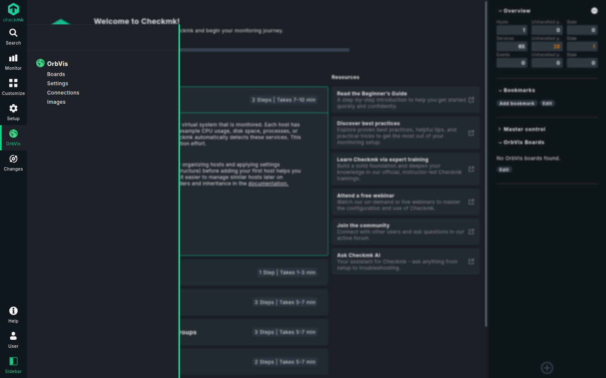
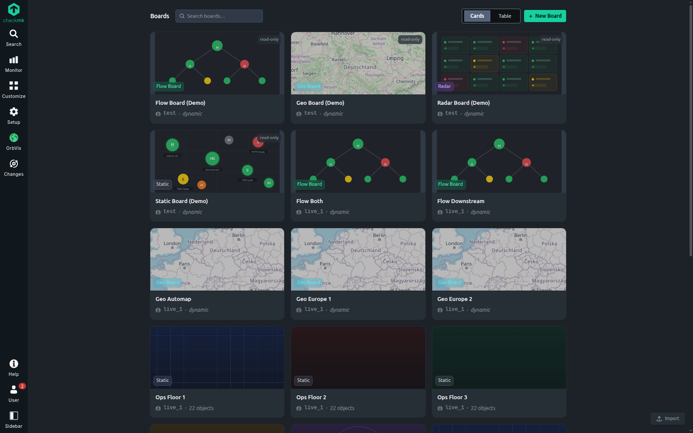
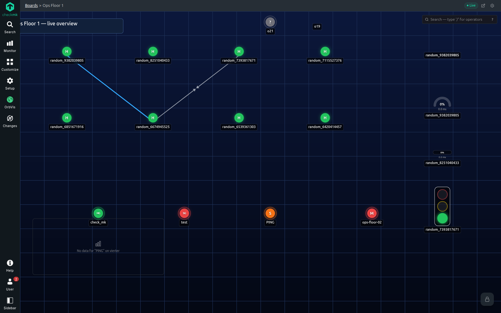
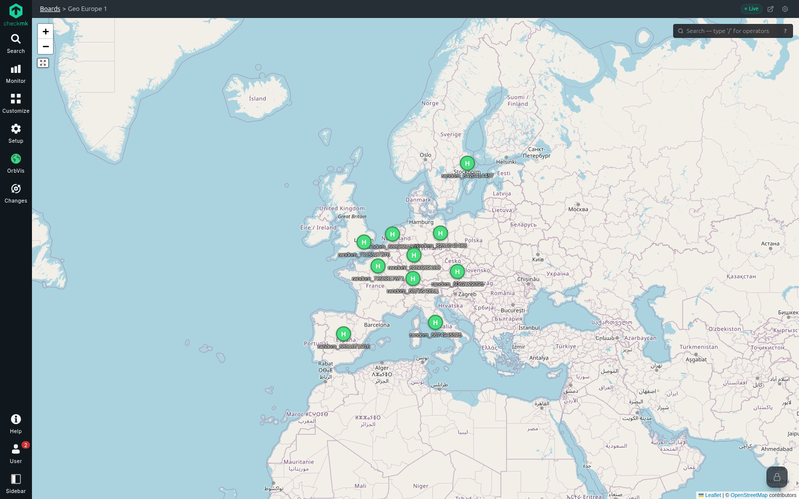
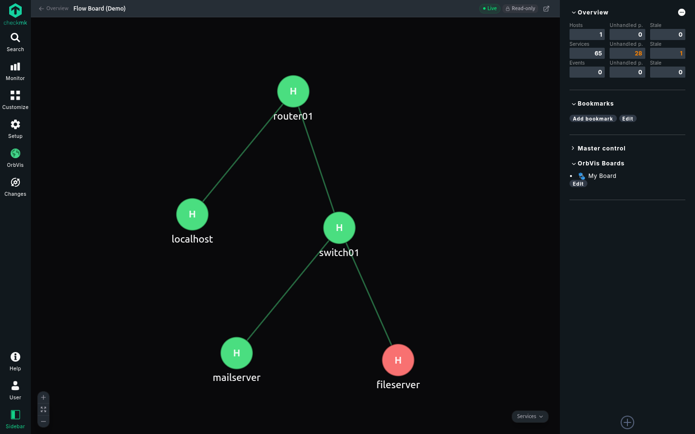
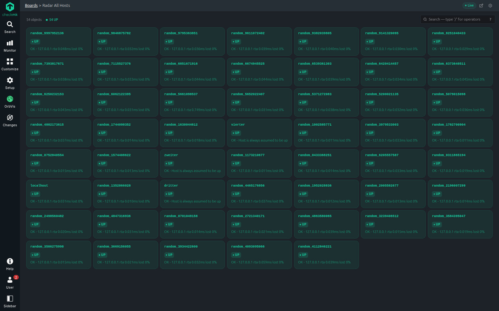
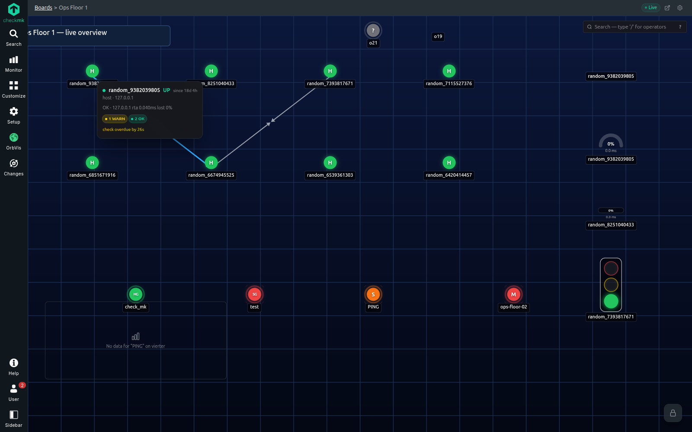
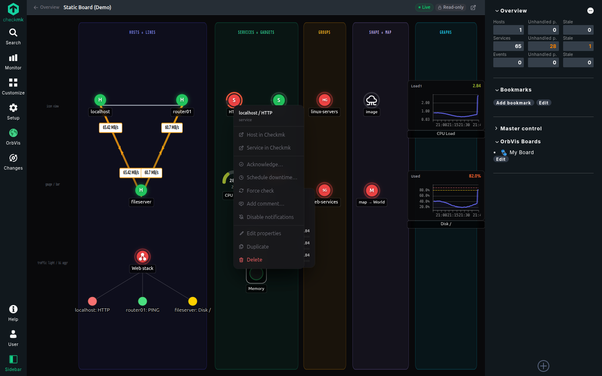
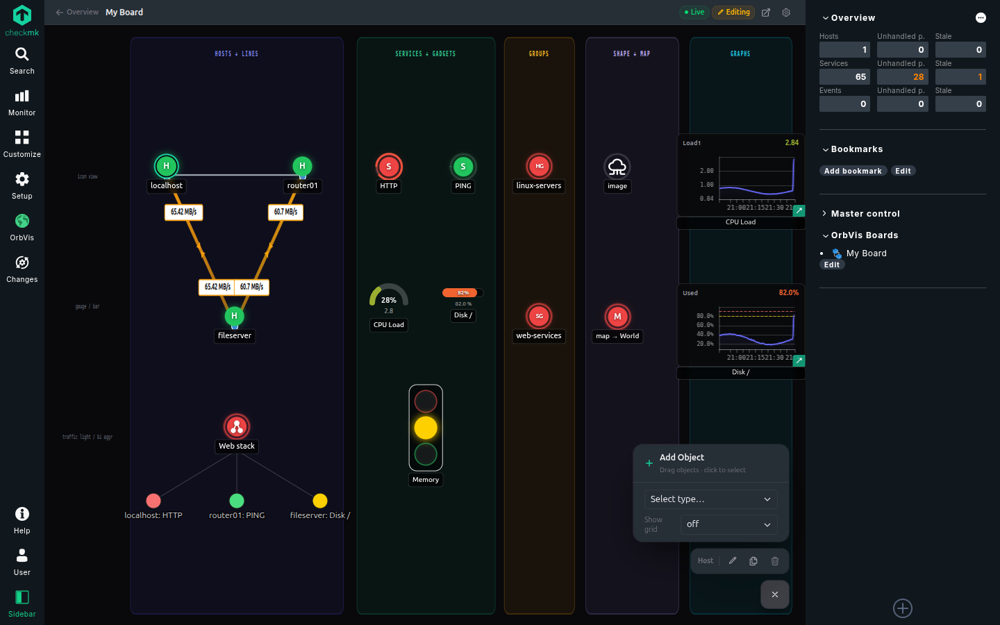
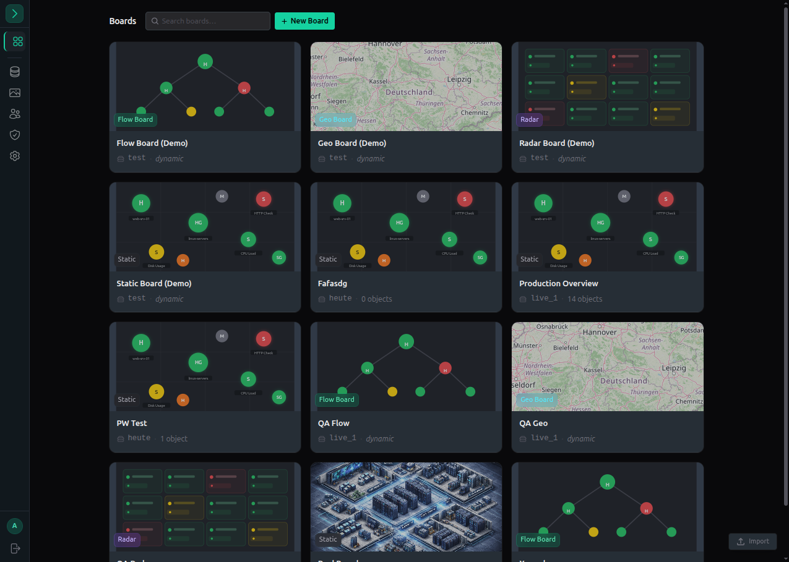

# OrbVis

A modern monitoring-visualisation platform — a community successor to
NagVis, designed primarily for use **inside Checkmk**. Real-time live
updates over Server-Sent Events, native Checkmk integration with
main-menu entry and sidebar snapin, force-directed topology and geo
boards. Built with **FastAPI** · **Vue 3** · **TypeScript** · **Vite** ·
**Pinia** · **D3.js**, on the Checkmk design system.

> **Status:** early release. OrbVis is primarily designed as a Checkmk
> integration and runs wherever Checkmk itself is supported. The
> standalone mode is developed and tested mainly on **Ubuntu 24.04**,
> but targets the same OS reach as Checkmk. Expect rough edges — issues
> and PRs are welcome. License: GPL-2.0-only.

> **A note on the name.** "OrbVis" is a working title for this private
> project and is not published as a package on PyPI, npm, or similar
> registries. Two unrelated projects share the name —
> [wojciech-graj/OrbVis](https://github.com/wojciech-graj/OrbVis) (a
> realtime satellite-orbit visualizer) and
> [staradutt/orbvis](https://github.com/staradutt/orbvis) (a Python
> package for VASP bandstructure/DOS plotting). Their domains are
> distinct from monitoring visualisation, so confusion in practice
> should be minimal. Should this project ever be integrated into
> Checkmk upstream, the name would most likely be reassigned at that
> point.

|  |  |
|---|---|
|  |  |
|  |  |
|  |  |
|  |  |

## Quickstart

Pre-built artefacts are on the [Releases](../../releases) page.

### Inside Checkmk (MKP)

```bash
omd su <site>
mkp add ~/orbvis-cmk-2.5.mkp   # pick MKP for your CMK major (2.3–2.6)
mkp enable orbvis
orbvis-setup
```

→ Full guide: [docs/install.md#1-checkmk-mkp](docs/install.md#1-checkmk-mkp)

### Standalone (.deb / .rpm)

```bash
sudo dpkg -i orbvis_X.Y.Z_amd64.deb     # or: sudo rpm -i orbvis-X.Y.Z.x86_64.rpm
orbvis-install                          # invoke as a normal user
```

→ Full guide: [docs/install.md#2-standalone-deb--rpm](docs/install.md#2-standalone-deb--rpm)

### Docker Compose

```bash
./bootstrap.sh                  # one-time: generates .env, ensures data/ dirs exist
docker compose up --build
```

Frontend on `http://localhost:8741`, API docs on `http://localhost:8742/api/docs`.
→ Full guide: [docs/install.md#4-docker-compose](docs/install.md#4-docker-compose)

### From source

```bash
./install.sh                    # standalone (systemd + nginx/Apache)
./install_cmk.sh <site-name>    # into an existing OMD site
```

→ Full guide: [docs/install.md#3-from-source](docs/install.md#3-from-source)

> **⚠️ Production:** keep uvicorn at one worker until the JWT blocklist
> moves to a shared store. All packaged install paths default to one
> worker. See [production hardening](docs/install.md#production-hardening).

## Documentation

- [Install guide](docs/install.md) — Checkmk MKP, standalone, Docker, source, production hardening
- [Architecture](docs/architecture.md) — backend, frontend, state pipeline
- [Troubleshooting](docs/troubleshooting.md)
- [OrbVis vs. NagVis](docs/comparison.md) — feature-parity matrix
- [Migration from NagVis](docs/migration-from-nagvis.md) — what carries over
- [Contributing](CONTRIBUTING.md) · [Code of Conduct](CODE_OF_CONDUCT.md) · [Security policy](SECURITY.md)

## Architecture (orientation)

```
orbvis/
├── backend/          Python 3.12 + FastAPI (async), stdlib sqlite3
├── frontend/         Vue 3 + TypeScript + Vite (Checkmk design system)
├── cmk_plugins/      Checkmk 2.4+ GUI plugins (sidebar, WATO permissions, menu)
├── cmk_plugins_23/   Checkmk 2.3 GUI plugins
├── scripts/          orbvis-setup / orbvis-install wrapper commands (in packages)
├── install.sh        Standalone install/remove (systemd + optional nginx/Apache)
├── install_cmk.sh    Checkmk/OMD install/remove
├── nfpm.yaml         Package definition (.deb/.rpm via nfpm)
└── docker-compose.yml
```

For backend / frontend / state-pipeline details see [docs/architecture.md](docs/architecture.md).

## Development

**Backend:**
```bash
cd backend
pip install -e ".[dev]"
cp .env.example .env   # edit as needed; see file for variable reference
uvicorn app.main:app --reload
```

**Frontend:**
```bash
cd frontend
npm install
npm run dev
```

**Tests:**
```bash
cd backend  && pytest
cd frontend && npm test
```

Interactive API docs run at `http://localhost:8000/api/docs` (or the
proxied path in deployed setups, e.g. `/<SITE>/orbvis/api/docs` inside a
Checkmk site). Inside a Checkmk site the docs page requires **2.5+**.
